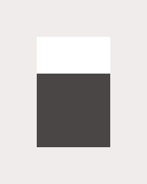
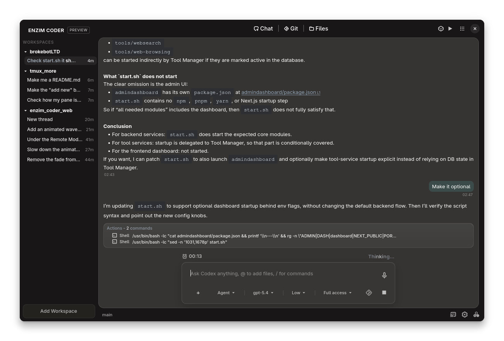
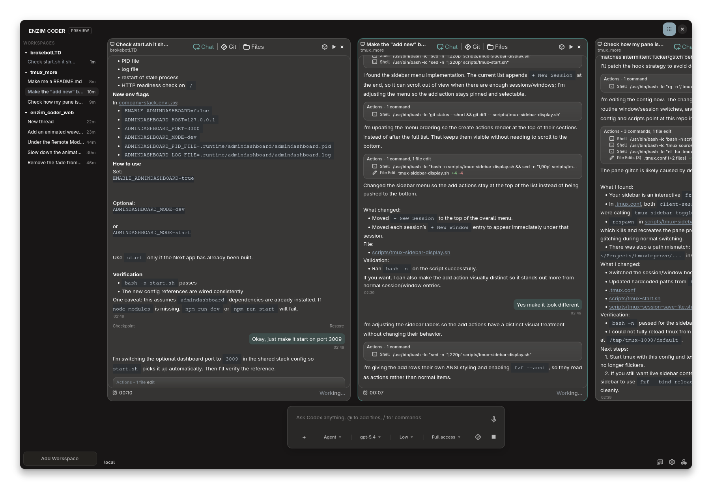
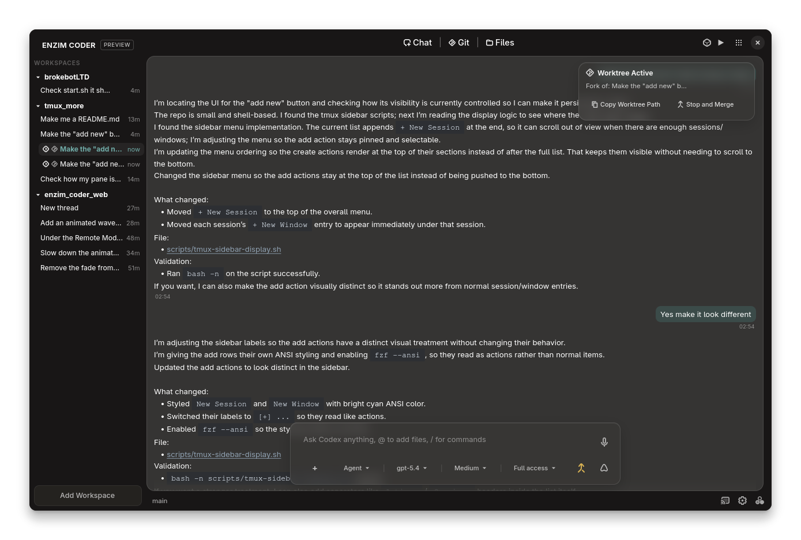
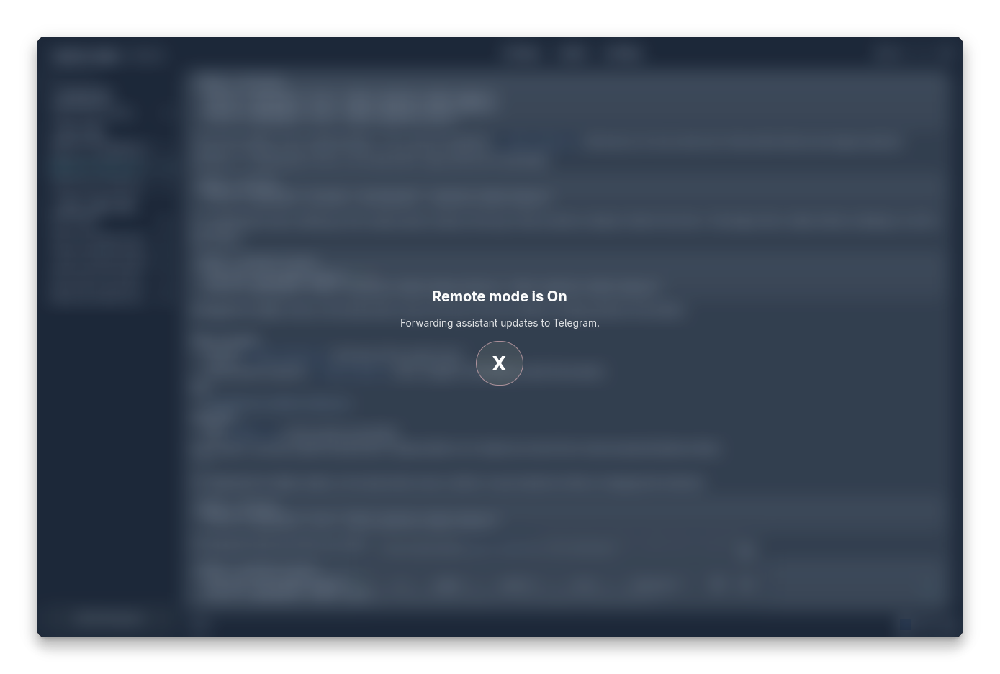

# Enzim Coder

> Enzim Coder is a GTK4/libadwaita desktop app for working with coding threads, workspaces, Git context, file browsing, and local agent sessions in one place.

Today it supports
 Codex and
 OpenCode.
<br>
<sub>Soon:  Claude Code,  Google CLI</sub>

<p align="center">
  <a href="screenshots/main.png"></a>
</p>
<table width="100%">
  <tr>
    <td align="center" width="33.33%">
      <a href="screenshots/multiview.png"></a>
    </td>
    <td align="center" width="33.33%">
      <a href="screenshots/worktree.png"></a>
    </td>
    <td align="center" width="33.33%">
      <a href="screenshots/remote.png"></a>
    </td>
  </tr>
  <tr>
    <td align="center"><sub>Multi-chat view</sub></td>
    <td align="center"><sub>Worktrees</sub></td>
    <td align="center"><sub>Remote</sub></td>
  </tr>
</table>

## ✨ Features

<table width="100%">
  <tr>
    <td align="center" width="50%">💬 Persistent Threads</td>
    <td align="center" width="50%">📁 Workspace-Scoped Chats</td>
  </tr>
  <tr>
    <td align="center">👤 Multi-Profile Sessions</td>
    <td align="center">🔄 Background Thread State</td>
  </tr>
  <tr>
    <td align="center">🪟 Multi-Pane Chat View</td>
    <td align="center">🌿 Built-in Git Tab</td>
  </tr>
  <tr>
    <td align="center">📂 Built-in File Browser</td>
    <td align="center">🔌 MCP and Skills UI</td>
  </tr>
  <tr>
    <td align="center">🎨 Runtime Theming</td>
    <td align="center">🗄️ Local SQLite Storage</td>
  </tr>
</table>

## 🚀 Getting Started

### 🧩 AppImage

Download the latest AppImage from the [GitHub Releases page](https://github.com/enz1m/enzim-coder/releases/latest).

Make it executable:

```bash
chmod +x EnzimCoder-*.AppImage
```

Run:

```bash
./EnzimCoder-*.AppImage
```

What the AppImage does:

1. On first `./EnzimCoder-*.AppImage` launch, it creates a user-scoped `.desktop` entry and icon automatically.
2. If you later move the AppImage to a different folder and run it again, that `.desktop` entry is updated to the new path automatically.
3. AppImage builds should offer update notifications automatically from GitHub Releases.
4. If the update prompt does not appear or the in-app update fails, download the latest release manually.

### 📦 Flatpak

Flatpak is coming soon.

For now, use the AppImage release.

## ⚙️ Runtime Requirements

Enzim Coder currently supports either the Codex CLI or the OpenCode CLI on the machine.

Install one or both:

```bash
npm i -g @openai/codex
curl -fsSL https://opencode.ai/install | bash
```

You can then create Codex and OpenCode profiles inside the app and authenticate the runtime you want to use. If neither supported CLI is available, the app will prompt for installation in the UI.

## 🖥️ Platform

- Linux desktop app
- Rust `1.92`
- GTK4 + libadwaita
- GTK `4.21+` enables backdrop blur
- older GTK builds fall back to a more opaque surface style automatically

## 🛠️ Development

### 🧱 Build From Source

System packages required:

- `gtk4`
- `libadwaita`
- `gtksourceview-5`
- `glib2`
- `pkg-config`
- C build toolchain

Build and run:

```bash
cargo run --release
```

For local testing with isolated app data:

```bash
ENZIMCODER_PROFILE_HOME_DIR=/path/to/testdir cargo run --release
```

## 🗂️ Project Layout

- `src/` application code
- `packaging/` release packaging
- `icons/` bundled icon subset used by the resource file

## 📝 Notes

- The bundled icons are documented separately in [icons/README.md](icons/README.md).

## 🚧 Status

This project is still in active iteration.
